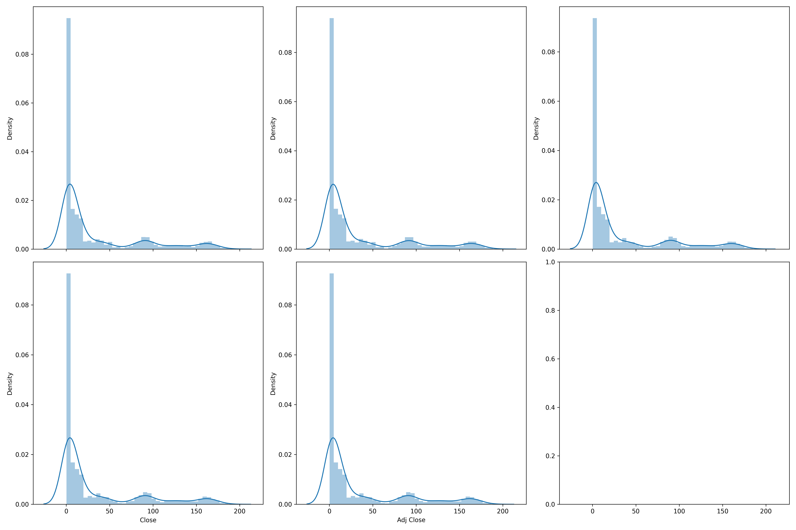
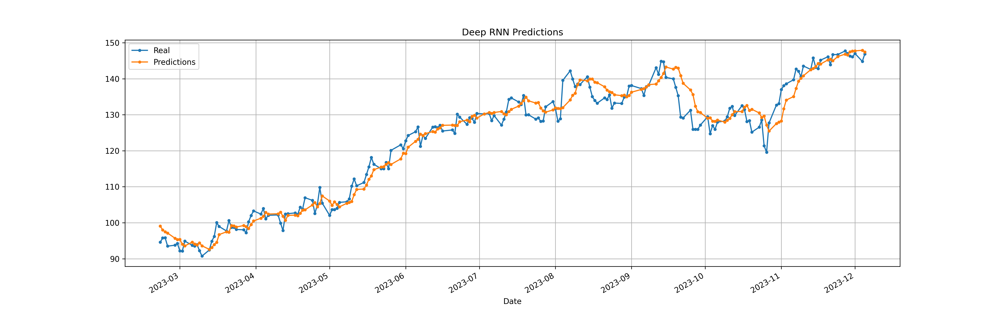
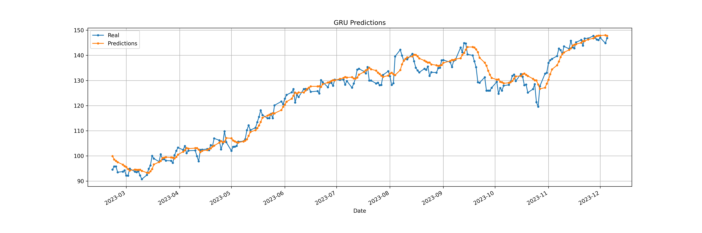

# Amazon Stock Price (Time Series Forecasting)

 Time series forecasting for Amazon stock prices involves predicting future stock values based on historical data. Utilizing advanced deep learning models like Recurrent Neural Networks (RNN), Long Short-Term Memory (LSTM), and Gated Recurrent Units (GRU) can offer sophisticated insights into the stock's behavior.

# Table of Contents

- [Amazon Stock Price (Time Series Forecasting)](#amazon-stock-price-time-series-forecasting)
- [Table of Contents](#table-of-contents)
- [Getting Started](#getting-started)
  - [Installation](#installation)
    - [Prerequisites](#prerequisites)
    - [Clone the Repository](#clone-the-repository)
    - [Create Virtual Environment (Optional)](#create-virtual-environment-optional)
  - [Dependencies](#dependencies)
    - [Install Dependencies](#install-dependencies)
  - [Project Organization](#project-organization)
- [Data Collection](#data-collection)
  - [Dataset Information:](#dataset-information)
  - [Dataset Columns](#dataset-columns)
  - [Purpose](#purpose)
  - [Usage](#usage)
- [Exploratory-Data-Analysis-(EDA)](#exploratory-data-analysis-eda)
  - [Time Series Visualization](#time-series-visualization)
  - [Yearly Data Analysis](#yearly-data-analysis)
  - [Average Monthly Stock Price Analysis](#average-monthly-stock-price-analysis)
  - [Seasonality Analysis: Monthly, Weekly, and Yearly](#seasonality-analysis-monthly-weekly-and-yearly)
    - [Monthly Seasonality](#monthly-seasonality)
    - [Weekly Seasonality](#weekly-seasonality)
    - [Yearly Seasonality](#yearly-seasonality)
  - [Distribution of Data](#distribution-of-data)
- [Data Preprocessing](#data-preprocessing)
  - [Preprocessing Steps](#preprocessing-steps)
- [Model Development](#model-development)
  - [Callbacks](#callbacks)
  - [Model Architecture](#model-architecture)
    - [Deep RNN](#deep-rnn)
    - [LSTM (Long Short-Term Memory)](#lstm-long-short-term-memory)
    - [GRU (Gated Recurrent Unit)](#gru-gated-recurrent-unit)
  - [Model Evaluation](#model-evaluation)
  - [Model Predictions](#model-predictions)
    - [Deep RNN](#deep-rnn-1)
    - [LSTM](#lstm)
    - [GRU](#gru)

# Getting Started

## Installation

To get started with this project, follow the steps below for a seamless installation of dependencies.

### Prerequisites

Make sure you have the following installed on your system:

- [Python](https://www.python.org/) (>=3.6)
- [virtualenv](https://virtualenv.pypa.io/) (for creating isolated Python environments) (Optional)

### Clone the Repository

```bash
git https://github.com/MohamedSamir245/Amazon-Stock-Price-Time-Series-Forecasting-
cd Amazon-Stock-Price-Time-Series-Forecasting-
```

### Create Virtual Environment (Optional)

```
# Create a virtual environment
virtualenv venv

# Activate the virtual environment
# On Windows
.\venv\Scripts\activate
# On macOS/Linux
source venv/bin/activate
```

## Dependencies

This project relies on the following Python packages:

- Keras==3.0.4
- Matplotlib==3.8.0
- NumPy==1.24.3
- Pandas==2.2.0
- scikit-learn==1.4.0
- Seaborn==0.13.2
- Setuptools==68.2.2
- TensorFlow==2.15.0.post1

### Install Dependencies

```
make requirements
```

## Project Organization

    .
    ├── data
    │   ├── external                <- Data from third party sources.
    │   │   └── AmazonStockPrice.csv
    │   └── processed               <- The final, canonical data sets for modeling.
    │       └── close_df.csv
    │   
    ├── LICENSE
    ├── Makefile
    ├── models                       <- Trained and serialized models, model predictions, or model summaries
    │   ├── checkpoint
    │   ├── close_GRU_model.h5
    │   ├── close_LSTM_model.h5
    │   ├── Close_model.h5
    │   ├── model_checkpoint.data-00000-of-00001
    │   └── model_checkpoint.index
    ├── notebooks
    │   ├── helper_functions.py
    │   └──  notebook.ipynb
    │   
    ├── README.md                    <- The top-level README for developers using this project.
    ├── reports
    │   ├── figures
    │   │   ├── Average price per month [2015-2023].png
    │   │   ├── Average price per month.png
    │   │   ├── Boxplot.png
    │   │   ├── Boxplot Volume.png
    │   │   ├── DeepRNN_Predictions.png
    │   │   ├── Distribution.png
    │   │   ├── Distribution Volume.png
    │   │   ├── GRU_Predictions.png
    │   │   ├── LSTM_Predictions.png
    │   │   ├── Model Comparison.png
    │   │   ├── Monthly Seasonality.png
    │   │   ├── Number of days per year.png
    │   │   ├── Stock Price [2023-2024].png
    │   │   ├── Weekly Seasonality.png
    │   │   └── Yearly Seasonality.png
    │   └── training_logs             <- Tensorboard logs for each model
    │       ├── Close
    │       ├── close_GRU
    │       └── close_LSTM
    ├── requirements.txt
    ├── setup.py
    ├── src
    │   ├── data & visualization
    │   │   ├── helper_functions.py
    │   │   ├── __init__.py
    │   │   ├── process_EDA.py
    │   ├── __init__.py
    │   └── models
    │       ├── helper_functions.py <- Script containing helper functions
    │       ├── __init__.py
    │       ├── predict_model.py    <- Script for making predictions
    │       └── train_model.py
    ├── test_environment.py         <- Script for testing the environment
    └── tox.ini                     <- tox file with settings for running tox; see tox.readthedocs.io

# Data Collection

The Amazon stock price dataset contains historical daily stock price data for Amazon.com Inc. (ticker symbol: AMZN). The dataset includes information such as the opening price, closing price, highest price, lowest price, and trading volume for each trading day. The data was sourced from [Kaggle](https://www.kaggle.com/datasets/henryshan/amazon-com-inc-amzn), covering several years of trading history for Amazon stock.


## Dataset Information:

- **Number of Entries**: ~7,000
- **Number of Features**: 7
- **Data Range**: 1997-05-15 to 2024-01-26

## Dataset Columns
The dataset consists of the following columns:
- **Date**: The date of the trading day.
- **Open**: The opening price of the stock on the trading day.
- **High**: The highest price of the stock during the trading day.
- **Low**: The lowest price of the stock during the trading day.
- **Close**: The closing price of the stock on the trading day.
- **Adj Close**: The adjusted closing price of the stock, adjusted for dividends and stock splits.
- **Volume**: The trading volume of the stock on the trading day.

## Purpose
The dataset is valuable for analyzing the historical performance of Amazon stock, identifying trends, and conducting technical analysis. It can be used by investors, financial analysts, data scientists, and researchers for various purposes such as trend prediction, volatility analysis, and backtesting of trading strategies.

## Usage
Researchers and analysts can use this dataset to perform a wide range of analyses, including:
- Time series forecasting to predict future stock prices.
- Correlation analysis with other financial instruments or economic indicators.
- Identification of patterns and trends using techniques such as moving averages, candlestick patterns, and momentum indicators.
- Backtesting of trading strategies to evaluate their performance over historical data.


# Exploratory-Data-Analysis-(EDA)

## Time Series Visualization

To gain an initial understanding of the Amazon stock price data, a time series visualization was created by plotting the stock prices from 2023 to 2024. This allowed for observing any trends, seasonality, or irregularities in the data.


## Yearly Data Analysis

Following the initial time series visualization, the data was grouped by year, and the number of entries per year was analyzed. It was observed that most years had around 250 entries, except for 1997 and 2024. Given the limited data for these two years, it was decided to remove them from the dataset to maintain consistency and reliability in the analysis.


## Average Monthly Stock Price Analysis

After grouping the data by month and calculating the average stock price for each month, I conducted an analysis to identify any notable trends or anomalies.


**Observation:** observed a significant surge in the stock price around 2020, which can be attributed to the impact of the coronavirus pandemic. With the widespread adoption of online shopping as a result of lockdown measures and social distancing protocols, there was a notable increase in demand for e-commerce services. This shift in consumer behavior likely contributed to the substantial growth in the stock price during this period.

This observation aligns with the broader economic and societal changes observed during the pandemic, highlighting the interconnectedness between global events and financial markets.


## Seasonality Analysis: Monthly, Weekly, and Yearly

### Monthly Seasonality

After grouping the data by month and analyzing the average stock price for each month, Investigated the presence of monthly seasonality in the Amazon stock price data.


**Observation:** The figure above displays the original monthly stock price data (solid line) and its lagged version (dashed line). From the observations in the figure, it's evident that the dashed line and solid line diverge significantly. Additionally, the difference between the original data and its lagged version is not close to zero (which could be approximated by the gradient). These findings suggest that there is no monthly seasonality present in the data.

### Weekly Seasonality

Next, I explored the existence of weekly seasonality by grouping the data by week and analyzing the average stock price for each week.


**Observation:** Similar to the analysis of monthly seasonality, the figure above illustrates the original weekly stock price data (solid line) and its lagged version (dashed line). Again, I observe a significant divergence between the dashed and solid lines, indicating the absence of weekly seasonality in the data.

### Yearly Seasonality

Finally, I examined the presence of yearly seasonality by grouping the data by year and analyzing the average stock price for each year.


**Observation:** The figure above depicts the original yearly stock price data (solid line) and its lagged version (dashed line). As with the previous analyses, I notice a notable difference between the two lines, suggesting that there is no significant yearly seasonality present in the data.

These findings indicate that the Amazon stock price data does not exhibit clear patterns of monthly, weekly, or yearly seasonality.


## Distribution of Data

To understand the distribution of the Amazon stock price data, I created a histogram plot showcasing the frequency distribution of the stock prices.




# Data Preprocessing
 For the sake of simplicity and time efficiency, I will focus solely on the 'Close' column. You may apply the same approach to the remaining columns as needed.

 The closing price is considered [the most accurate valuation of a stock](https://www.investopedia.com/terms/c/closingprice.asp#:~:text=The%20closing%20price%20is%20considered,market%20sentiment%20toward%20that%20stock) or other security until trading resumes on the next trading day.

 The closing price on one day can be compared to the closing price on the previous day, 30 days earlier or a year earlier, to measure the changes in market sentiment toward that stock.

 ## Preprocessing Steps
  Firstly, the data will be normalized using the MinMaxScaler to ensure that all values are between 0 and 1.


Will utilize every 56-day window from historical data as training samples. For each window, the target value will be the data point immediately following it.
 ```python
 def create_sequences(data, seq_length):
    sequences, labels = [], []
    for i in range(len(data) - seq_length):
        seq = data[i:i + seq_length]
        label = data[i + seq_length]
        sequences.append(seq)
        labels.append(label)
    return np.array(sequences), np.array(labels)
 ```

 Afterwards, the dataset will be partitioned into training, validation, and testing sets. Following partitioning, the data will be organized into batches of 32 samples each for training purposes.
  ```python
  def get_train_valid_test_split(data, labels):
    X_train, X_test, y_train, y_test = train_test_split(data, labels, test_size=0.1, shuffle=True, random_state=42)
    X_train, X_valid, y_train, y_valid = train_test_split(X_train, y_train, test_size=0.1, shuffle=True, random_state=42)
    return X_train,X_valid, X_test, y_train,y_valid, y_test
  ```
  ```python
  seq_length = 56

def get_train_valid_test_datasets(X_train,X_valid, X_test, y_train,y_valid, y_test):
    train_ds=tf.data.Dataset.from_tensor_slices((X_train, y_train))
    train_ds=train_ds.batch(32)
    valid_ds=tf.data.Dataset.from_tensor_slices((X_valid, y_valid))
    valid_ds=valid_ds.batch(32)
    test_ds=tf.data.Dataset.from_tensor_slices((X_test, y_test))
    test_ds=test_ds.batch(32)
    return train_ds,valid_ds,test_ds
    
  ```

  
# Model Development

## Callbacks

In this project, I employed several callbacks to enhance the training process and monitor the performance of our model:

1. **ModelCheckpoint**: This callback saves the model's weights after every epoch if the validation mean absolute error (`val_mae`) has improved, ensuring that I always have access to the best-performing model. The saved weights are stored in the directory specified by `checkpoint_path`.

    ```python
    checkpoint_path = "model_checkpoint"
    checkpoint_callback = tf.keras.callbacks.ModelCheckpoint(checkpoint_path,
                                                             save_weights_only=True,
                                                             monitor="val_mae",
                                                             save_best_only=True)
    ```

2. **EarlyStopping**: This callback is configured to monitor the validation mean absolute error (`val_mae`). It halts the training process if the `val_mae` metric does not show improvement for 50 consecutive epochs, thereby preventing overfitting. The `restore_best_weights` parameter ensures that the model's weights are restored to the best-performing configuration.

    ```python
    early_stopping = tf.keras.callbacks.EarlyStopping(monitor="val_mae",
                                                      patience=50,
                                                      restore_best_weights=True)
    ```

3. **ReduceLROnPlateau**: This callback adjusts the learning rate (`lr`) when the validation loss (`val_loss`) plateaus. It reduces the learning rate by a factor of 0.2 if no improvement is observed in the validation loss for 30 consecutive epochs, ensuring smoother convergence during training.

    ```python
    reduce_lr = tf.keras.callbacks.ReduceLROnPlateau(
        monitor='val_loss', factor=0.2, patience=30, min_lr=1e-6)
    ```

These callbacks collectively contribute to more efficient training and help prevent overfitting by monitoring key metrics and adjusting the learning rate accordingly.

## Model Architecture

In this project, I explore the performance of various recurrent neural network (RNN) architectures, including deep RNN, Long Short-Term Memory (LSTM), and Gated Recurrent Unit (GRU), for forecasting Amazon stock prices.

### Deep RNN

Deep RNNs are characterized by multiple layers of recurrent units, allowing the model to capture complex temporal dependencies in the data. I employed deep RNN architecture to leverage its ability to learn hierarchical representations of sequential data.


### LSTM (Long Short-Term Memory)


 The long short-term memory (LSTM) cell can be use for tackling the short-term memory problem

 As the long-term state c(t–1). traverses the network from left to right, you can see that it first goes through a forget gate, dropping some memories, and then it adds some new memories via the addition operation (which adds the memories that were selected by an input gate). The result c(t) is sent straight out, without any further transformation. So, at each time step, some memories are dropped and some memories are added. Moreover, after the addition operation, the long-term state is copied and passed through the tanh function, and then the result is filtered by the output gate. This produces the short-term state h(t) (which is equal to the cell’s output for this time step, y(t)).

First, the current input vector x(t) and the previous short-term state h(t–1) are fed to four different fully connected layers. They all serve a different purpose:

- The main layer is the one that outputs g(t). It has the usual role of
analyzing the current inputs x(t) and the previous (short-term) state h(t–1).
In a basic cell, there is nothing other than this layer, and its output goes
straight out to y(t) and h(t). But in an LSTM cell, this layer’s output does
not go straight out; instead its most important parts are stored in the long-term state (and the rest is dropped).
- The three other layers are gate controllers. Since they use the logistic
activation function, the outputs range from 0 to 1. As you can see, the
gate controllers’ outputs are fed to element-wise multiplication
operations: if they output 0s they close the gate, and if they output 1s they
open it. Specifically:
    - The forget gate (controlled by f(t)) controls which parts of
    the long-term state should be erased.
    - The input gate (controlled by i(t)) controls which parts of
    g(t) should be added to the long-term state.
    - Finally, the output gate (controlled by o(t)) controls which
    parts of the long-term state should be read and output at
    this time step, both to h(t) and to y(t).
    
 In short, an LSTM cell can learn to recognize an important input (that’s the role of the input gate), store it in the long-term state, preserve it for as long as it is needed (that’s the role of the forget gate), and extract it whenever it is needed. This explains why these cells have been amazingly successful at capturing long-term patterns in time series, long texts, audio recordings, and more.

### GRU (Gated Recurrent Unit)


The gated recurrent unit (GRU) cell is a simplified version of the LSTM cell, and it seems to perform just as well (which explains its growing popularity). These are the main simplifications:

- Both state vectors are merged into a single vector h(t).
- A single gate controller z(t) controls both the forget gate and the input
gate. If the gate controller outputs a 1, the forget gate is open (= 1) and
the input gate is closed (1 – 1 = 0). If it outputs a 0, the opposite happens.
In other words, whenever a memory must be stored, the location where it
will be stored is erased first. This is actually a frequent variant to the
LSTM cell in and of itself.
- There is no output gate; the full state vector is output at every time step.
However, there is a new gate controller r(t) that controls which part of the
previous state will be shown to the main layer (g(t)).

By experimenting with different RNN architectures, I aim to identify the most effective model for forecasting Amazon stock prices, considering factors such as prediction accuracy, computational efficiency, and model complexity.

## Model Evaluation

After training, the trained models are evaluated on the validation set to assess their performance in forecasting Amazon stock prices. Evaluation metrics such as MAE, mean squared error (MSE), and root mean squared error (RMSE) are calculated to quantify the models' accuracy.


## Model Predictions

Finally, the trained models are used to make predictions on the test set. The predictions are then compared to the actual stock prices to visualize the models' performance.

### Deep RNN


### LSTM


### GRU

